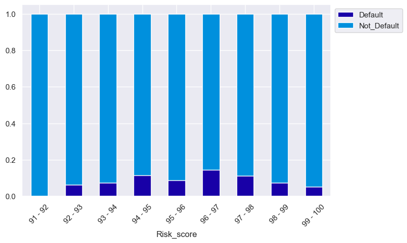

<details>
<summary>Importing Libraries & Data ingestion </summary>
<br>
# Library importation


```python
# Basic packages
import pandas as pd
import numpy as np
import matplotlib.pyplot as plt
import seaborn as sns
import scipy as spy
%matplotlib inline
import copy
import math
```


```python
# Suppress warnings
import warnings
warnings.filterwarnings('ignore')
```


```python
# Pandas display settings - columns

# Display all columns
pd.set_option("display.max_columns", None)
```

---

## Data ingestion 


```python
# Load dataset
data = pd.read_excel("InsurancePremiumDefault.xlsx",sheet_name='premium')
```

---

Let's rename the variables for ease of programming


```python
# Column rename dictionary
renamed_columns = {
    'id': 'ID',
    'perc_premium_paid_by_cash_credit': 'Perc_premium_paid_in_cash',
    'age_in_days': 'Age_in_days',
    'Count_3-6_months_late': 'Late_premium_payment_3-6_months',
    'Count_6-12_months_late': 'Late_premium_payment_6-12_months',
    'Count_more_than_12_months_late': 'Late_premium_payment_>12_months',
    'Marital Status': 'Marital_Status',
    'Veh_Owned': 'Vehicles_Owned',
    'No_of_dep': 'No_of_dependents',
    'risk_score': 'Risk_score',
    'no_of_premiums_paid': 'No_of_premiums_paid',
    'sourcing_channel': 'Sourcing_channel',
    'residence_area_type': 'Customer_demographic',
    'premium': 'Premium_payment',
    'default': 'Default'
}

# Rename dataframe columns names
data = data.rename(columns = renamed_columns)
```

---

**Convert Pandas Objects to Category type**


```python
# Convert variables with "object" type to "category" type
for i in data.columns:
    if data[i].dtypes == "object":
        data[i] = data[i].astype("category") 

# Confirm if there no variables with "object" type
data.info()
```

    <class 'pandas.core.frame.DataFrame'>
    RangeIndex: 79853 entries, 0 to 79852
    Data columns (total 17 columns):
     #   Column                            Non-Null Count  Dtype   
    ---  ------                            --------------  -----   
     0   ID                                79853 non-null  int64   
     1   Perc_premium_paid_in_cash         79853 non-null  float64 
     2   Age_in_days                       79853 non-null  int64   
     3   Income                            79853 non-null  int64   
     4   Late_premium_payment_3-6_months   79853 non-null  int64   
     5   Late_premium_payment_6-12_months  79853 non-null  int64   
     6   Late_premium_payment_>12_months   79853 non-null  int64   
     7   Marital_Status                    79853 non-null  int64   
     8   Vehicles_Owned                    79853 non-null  int64   
     9   No_of_dependents                  79853 non-null  int64   
     10  Accomodation                      79853 non-null  int64   
     11  Risk_score                        79853 non-null  float64 
     12  No_of_premiums_paid               79853 non-null  int64   
     13  Sourcing_channel                  79853 non-null  category
     14  Customer_demographic              79853 non-null  category
     15  Premium_payment                   79853 non-null  int64   
     16  Default                           79853 non-null  int64   
    dtypes: category(2), float64(2), int64(13)
    memory usage: 9.3 MB
    

**Dropping ID variable**


```python
data.drop(columns="ID", axis=1, inplace=True)
```

---

**Create a list of numerical variables**


```python
numerical_vars = [
    'Perc_premium_paid_in_cash', 'Age_in_days', 'Income', 'Risk_score',
    'No_of_premiums_paid', 'Premium_payment'
]
```

**Create a list of categorical variables**


```python
categorical_vars = [
    'Late_premium_payment_3-6_months', 'Late_premium_payment_6-12_months',
    'Late_premium_payment_>12_months', 'Marital_Status', 'Vehicles_Owned',
    'No_of_dependents', 'Accomodation', 'Sourcing_channel',
    'Customer_demographic', 'Default'
]
```

</details>

---

# Feature Engineering

---

Data pre-proprocessing is a vital stage in the data preparation for model building.

To prevent loss or corruption of the data, let's clone the dataframe first.


```python
# Create copy of dataframe
df = copy.deepcopy(data)
```

---

## Missing Value Treatment

From the analysis in Part1 above, since in the dataset there **No Missing Values** then <font color='red'>**Missing Value Treatment** will **NOT** be required</font> . 

For completeness, let's verify again


```python
def missing_val_chk(data):
    """
    This function to checks for missing values 
    and generates a summary.
    """
    if data.isnull().sum().any() == True:
        # Number of missing in each column
        missing_vals = pd.DataFrame(data.isnull().sum().sort_values(
            ascending=False)).rename(columns={0: '# missing'})

        # Create a percentage missing
        missing_vals['percent'] = ((missing_vals['# missing'] / len(data)) *
                                   100).round(decimals=3)

        # Remove rows with 0
        missing_vals = missing_vals[missing_vals['# missing'] != 0].dropna()

        # display missing value dataframe
        print("The missing values summary")
        display(missing_vals)
    else:
        print("There are NO missing values in the dataset")
```


```python
# Check for missing values using define function
missing_val_chk(df)
```

    There are NO missing values in the dataset
    

---

## Variable Transformation

In Part 1, we have noticed that the dataset consists of series of numerical and categorical variables.

The **numerical variables** are skewed and have many outliers while the **categorical variables** are predominantly ordinal with numerical nature.

Let's focus on the numerical variables first.

### Numerical Variables

Since the numerical variables consist of many outliers, let's bin each variable into categories. This will accomodate for the range of outliers without losing any data.

#### Perc_premium_paid_in_cash


```python
df['Perc_premium_paid_in_cash'].describe()
```


    count    79853.000000
    mean         0.314288
    std          0.334915
    min          0.000000
    25%          0.034000
    50%          0.167000
    75%          0.538000
    max          1.000000
    Name: Perc_premium_paid_in_cash, dtype: float64


Since Percentage Premium Pay in Cash ranges from 0(min) to 1(max), let's split into intervals of 0.1


```python
# Bin Perc_premium_paid_in_cash variable
df.Perc_premium_paid_in_cash = pd.cut(
    df.Perc_premium_paid_in_cash,
    bins=[0, 0.1, 0.2, 0.3, 0.4, 0.5, 0.6, 0.7, 0.8, 0.9, 1],
    labels=[
        "0 - 0.1", "0.1 - 0.2", "0.2 - 0.3", "0.3 - 0.4", "0.4 - 0.5",
        "0.5 - 0.6", "0.6 - 0.7", "0.7 - 0.8", "0.8 - 0.9", "0.9 - 1"
    ],
    include_lowest=1)
# Preview head of dataframe
df.head()
```


<div>

*Output:*


<table border="1" class="dataframe">
  <thead>
    <tr style="text-align: right;">
      <th></th>
      <th>Perc_premium_paid_in_cash</th>
      <th>Age_in_days</th>
      <th>Income</th>
      <th>Late_premium_payment_3-6_months</th>
      <th>Late_premium_payment_6-12_months</th>
      <th>Late_premium_payment_&gt;12_months</th>
      <th>Marital_Status</th>
      <th>Vehicles_Owned</th>
      <th>No_of_dependents</th>
      <th>Accomodation</th>
      <th>Risk_score</th>
      <th>No_of_premiums_paid</th>
      <th>Sourcing_channel</th>
      <th>Customer_demographic</th>
      <th>Premium_payment</th>
      <th>Default</th>
    </tr>
  </thead>
  <tbody>
    <tr>
      <th>0</th>
      <td>0.3 - 0.4</td>
      <td>11330</td>
      <td>90050</td>
      <td>0</td>
      <td>0</td>
      <td>0</td>
      <td>0</td>
      <td>3</td>
      <td>3</td>
      <td>1</td>
      <td>98.810</td>
      <td>8</td>
      <td>A</td>
      <td>Rural</td>
      <td>5400</td>
      <td>1</td>
    </tr>
    <tr>
      <th>1</th>
      <td>0 - 0.1</td>
      <td>30309</td>
      <td>156080</td>
      <td>0</td>
      <td>0</td>
      <td>0</td>
      <td>1</td>
      <td>3</td>
      <td>1</td>
      <td>1</td>
      <td>99.066</td>
      <td>3</td>
      <td>A</td>
      <td>Urban</td>
      <td>11700</td>
      <td>1</td>
    </tr>
    <tr>
      <th>2</th>
      <td>0 - 0.1</td>
      <td>16069</td>
      <td>145020</td>
      <td>1</td>
      <td>0</td>
      <td>0</td>
      <td>0</td>
      <td>1</td>
      <td>1</td>
      <td>1</td>
      <td>99.170</td>
      <td>14</td>
      <td>C</td>
      <td>Urban</td>
      <td>18000</td>
      <td>1</td>
    </tr>
    <tr>
      <th>3</th>
      <td>0 - 0.1</td>
      <td>23733</td>
      <td>187560</td>
      <td>0</td>
      <td>0</td>
      <td>0</td>
      <td>1</td>
      <td>1</td>
      <td>1</td>
      <td>0</td>
      <td>99.370</td>
      <td>13</td>
      <td>A</td>
      <td>Urban</td>
      <td>13800</td>
      <td>1</td>
    </tr>
    <tr>
      <th>4</th>
      <td>0.8 - 0.9</td>
      <td>19360</td>
      <td>103050</td>
      <td>7</td>
      <td>3</td>
      <td>4</td>
      <td>0</td>
      <td>2</td>
      <td>1</td>
      <td>0</td>
      <td>98.800</td>
      <td>15</td>
      <td>A</td>
      <td>Urban</td>
      <td>7500</td>
      <td>0</td>
    </tr>
  </tbody>
</table>
</div>


Distribution of binned **Perc_premium_paid_in_cash**


```python
df["Perc_premium_paid_in_cash"].value_counts()
```


    Perc_premium_paid_in_cash
    0 - 0.1      32999
    0.1 - 0.2     9569
    0.9 - 1       8814
    0.2 - 0.3     6454
    0.3 - 0.4     5076
    0.4 - 0.5     4300
    0.5 - 0.6     3614
    0.6 - 0.7     3172
    0.8 - 0.9     2987
    0.7 - 0.8     2868
    Name: count, dtype: int64


---

#### Age_in_days

This variable shows the age of the policy holder in days, lets create a new Age variable in terms of years.


```python
# Create a new Age variable (year rounded)
# since a leap year occurs every 4 year, use 365.25 days per year
df["Age_in_years"] = np.round(df.Age_in_days / 365.25)
```


```python
# Check to see if "Age_in_years" added to dataframe
df.head()
```


<div>

*Output:*


<table border="1" class="dataframe">
  <thead>
    <tr style="text-align: right;">
      <th></th>
      <th>Perc_premium_paid_in_cash</th>
      <th>Age_in_days</th>
      <th>Income</th>
      <th>Late_premium_payment_3-6_months</th>
      <th>Late_premium_payment_6-12_months</th>
      <th>Late_premium_payment_&gt;12_months</th>
      <th>Marital_Status</th>
      <th>Vehicles_Owned</th>
      <th>No_of_dependents</th>
      <th>Accomodation</th>
      <th>Risk_score</th>
      <th>No_of_premiums_paid</th>
      <th>Sourcing_channel</th>
      <th>Customer_demographic</th>
      <th>Premium_payment</th>
      <th>Default</th>
      <th>Age_in_years</th>
    </tr>
  </thead>
  <tbody>
    <tr>
      <th>0</th>
      <td>0.3 - 0.4</td>
      <td>11330</td>
      <td>90050</td>
      <td>0</td>
      <td>0</td>
      <td>0</td>
      <td>0</td>
      <td>3</td>
      <td>3</td>
      <td>1</td>
      <td>98.810</td>
      <td>8</td>
      <td>A</td>
      <td>Rural</td>
      <td>5400</td>
      <td>1</td>
      <td>31.0</td>
    </tr>
    <tr>
      <th>1</th>
      <td>0 - 0.1</td>
      <td>30309</td>
      <td>156080</td>
      <td>0</td>
      <td>0</td>
      <td>0</td>
      <td>1</td>
      <td>3</td>
      <td>1</td>
      <td>1</td>
      <td>99.066</td>
      <td>3</td>
      <td>A</td>
      <td>Urban</td>
      <td>11700</td>
      <td>1</td>
      <td>83.0</td>
    </tr>
    <tr>
      <th>2</th>
      <td>0 - 0.1</td>
      <td>16069</td>
      <td>145020</td>
      <td>1</td>
      <td>0</td>
      <td>0</td>
      <td>0</td>
      <td>1</td>
      <td>1</td>
      <td>1</td>
      <td>99.170</td>
      <td>14</td>
      <td>C</td>
      <td>Urban</td>
      <td>18000</td>
      <td>1</td>
      <td>44.0</td>
    </tr>
    <tr>
      <th>3</th>
      <td>0 - 0.1</td>
      <td>23733</td>
      <td>187560</td>
      <td>0</td>
      <td>0</td>
      <td>0</td>
      <td>1</td>
      <td>1</td>
      <td>1</td>
      <td>0</td>
      <td>99.370</td>
      <td>13</td>
      <td>A</td>
      <td>Urban</td>
      <td>13800</td>
      <td>1</td>
      <td>65.0</td>
    </tr>
    <tr>
      <th>4</th>
      <td>0.8 - 0.9</td>
      <td>19360</td>
      <td>103050</td>
      <td>7</td>
      <td>3</td>
      <td>4</td>
      <td>0</td>
      <td>2</td>
      <td>1</td>
      <td>0</td>
      <td>98.800</td>
      <td>15</td>
      <td>A</td>
      <td>Urban</td>
      <td>7500</td>
      <td>0</td>
      <td>53.0</td>
    </tr>
  </tbody>
</table>
</div>


```python
df["Age_in_years"].describe()
```


    count    79853.000000
    mean        51.607404
    std         14.270484
    min         21.000000
    25%         41.000000
    50%         51.000000
    75%         62.000000
    max        103.000000
    Name: Age_in_years, dtype: float64


Since "Age in Years" ranges from 21(min) to 103(max), let's split into decades from 20 to 70 and >70.


```python
# Bin Age_in_years variable
df["Age_in_years"] = pd.cut(
    df["Age_in_years"],
    bins=[20, 30, 40, 50, 60, 70, 103],
    labels=["20 - 30", "30 - 40", "40 - 50", "50 - 60", "60 - 70", ">70"])
# Preview head of dataframe
df.head()
```


<div>

*Output:*


<table border="1" class="dataframe">
  <thead>
    <tr style="text-align: right;">
      <th></th>
      <th>Perc_premium_paid_in_cash</th>
      <th>Age_in_days</th>
      <th>Income</th>
      <th>Late_premium_payment_3-6_months</th>
      <th>Late_premium_payment_6-12_months</th>
      <th>Late_premium_payment_&gt;12_months</th>
      <th>Marital_Status</th>
      <th>Vehicles_Owned</th>
      <th>No_of_dependents</th>
      <th>Accomodation</th>
      <th>Risk_score</th>
      <th>No_of_premiums_paid</th>
      <th>Sourcing_channel</th>
      <th>Customer_demographic</th>
      <th>Premium_payment</th>
      <th>Default</th>
      <th>Age_in_years</th>
    </tr>
  </thead>
  <tbody>
    <tr>
      <th>0</th>
      <td>0.3 - 0.4</td>
      <td>11330</td>
      <td>90050</td>
      <td>0</td>
      <td>0</td>
      <td>0</td>
      <td>0</td>
      <td>3</td>
      <td>3</td>
      <td>1</td>
      <td>98.810</td>
      <td>8</td>
      <td>A</td>
      <td>Rural</td>
      <td>5400</td>
      <td>1</td>
      <td>30 - 40</td>
    </tr>
    <tr>
      <th>1</th>
      <td>0 - 0.1</td>
      <td>30309</td>
      <td>156080</td>
      <td>0</td>
      <td>0</td>
      <td>0</td>
      <td>1</td>
      <td>3</td>
      <td>1</td>
      <td>1</td>
      <td>99.066</td>
      <td>3</td>
      <td>A</td>
      <td>Urban</td>
      <td>11700</td>
      <td>1</td>
      <td>&gt;70</td>
    </tr>
    <tr>
      <th>2</th>
      <td>0 - 0.1</td>
      <td>16069</td>
      <td>145020</td>
      <td>1</td>
      <td>0</td>
      <td>0</td>
      <td>0</td>
      <td>1</td>
      <td>1</td>
      <td>1</td>
      <td>99.170</td>
      <td>14</td>
      <td>C</td>
      <td>Urban</td>
      <td>18000</td>
      <td>1</td>
      <td>40 - 50</td>
    </tr>
    <tr>
      <th>3</th>
      <td>0 - 0.1</td>
      <td>23733</td>
      <td>187560</td>
      <td>0</td>
      <td>0</td>
      <td>0</td>
      <td>1</td>
      <td>1</td>
      <td>1</td>
      <td>0</td>
      <td>99.370</td>
      <td>13</td>
      <td>A</td>
      <td>Urban</td>
      <td>13800</td>
      <td>1</td>
      <td>60 - 70</td>
    </tr>
    <tr>
      <th>4</th>
      <td>0.8 - 0.9</td>
      <td>19360</td>
      <td>103050</td>
      <td>7</td>
      <td>3</td>
      <td>4</td>
      <td>0</td>
      <td>2</td>
      <td>1</td>
      <td>0</td>
      <td>98.800</td>
      <td>15</td>
      <td>A</td>
      <td>Urban</td>
      <td>7500</td>
      <td>0</td>
      <td>50 - 60</td>
    </tr>
  </tbody>
</table>
</div>


Distribution of binned **Age_in_years**


```python
df["Age_in_years"].value_counts()
```


    Age_in_years
    40 - 50    19678
    50 - 60    18900
    60 - 70    13918
    30 - 40    13718
    >70         8181
    20 - 30     5458
    Name: count, dtype: int64


Drop Age_in_days column


```python
df.drop(columns = "Age_in_days", inplace = True)
```

---

#### Income

This variable shows the income of the policy holders


```python
df.Income.describe()
```


    count    7.985300e+04
    mean     2.088472e+05
    std      4.965826e+05
    min      2.403000e+04
    25%      1.080100e+05
    50%      1.665600e+05
    75%      2.520900e+05
    max      9.026260e+07
    Name: Income, dtype: float64


Since Income ranges from 24,030(min) to 90,262,600(max), let's create a new varible in '000 


```python
# Create a new Income variable ('000)
df["Income_'000"] = df.Income / 1000
```


```python
# Check to see if "Income_'000" added to dataframe
df.head()
```


<div>

*Output:*


<table border="1" class="dataframe">
  <thead>
    <tr style="text-align: right;">
      <th></th>
      <th>Perc_premium_paid_in_cash</th>
      <th>Income</th>
      <th>Late_premium_payment_3-6_months</th>
      <th>Late_premium_payment_6-12_months</th>
      <th>Late_premium_payment_&gt;12_months</th>
      <th>Marital_Status</th>
      <th>Vehicles_Owned</th>
      <th>No_of_dependents</th>
      <th>Accomodation</th>
      <th>Risk_score</th>
      <th>No_of_premiums_paid</th>
      <th>Sourcing_channel</th>
      <th>Customer_demographic</th>
      <th>Premium_payment</th>
      <th>Default</th>
      <th>Age_in_years</th>
      <th>Income_'000</th>
    </tr>
  </thead>
  <tbody>
    <tr>
      <th>0</th>
      <td>0.3 - 0.4</td>
      <td>90050</td>
      <td>0</td>
      <td>0</td>
      <td>0</td>
      <td>0</td>
      <td>3</td>
      <td>3</td>
      <td>1</td>
      <td>98.810</td>
      <td>8</td>
      <td>A</td>
      <td>Rural</td>
      <td>5400</td>
      <td>1</td>
      <td>30 - 40</td>
      <td>90.05</td>
    </tr>
    <tr>
      <th>1</th>
      <td>0 - 0.1</td>
      <td>156080</td>
      <td>0</td>
      <td>0</td>
      <td>0</td>
      <td>1</td>
      <td>3</td>
      <td>1</td>
      <td>1</td>
      <td>99.066</td>
      <td>3</td>
      <td>A</td>
      <td>Urban</td>
      <td>11700</td>
      <td>1</td>
      <td>&gt;70</td>
      <td>156.08</td>
    </tr>
    <tr>
      <th>2</th>
      <td>0 - 0.1</td>
      <td>145020</td>
      <td>1</td>
      <td>0</td>
      <td>0</td>
      <td>0</td>
      <td>1</td>
      <td>1</td>
      <td>1</td>
      <td>99.170</td>
      <td>14</td>
      <td>C</td>
      <td>Urban</td>
      <td>18000</td>
      <td>1</td>
      <td>40 - 50</td>
      <td>145.02</td>
    </tr>
    <tr>
      <th>3</th>
      <td>0 - 0.1</td>
      <td>187560</td>
      <td>0</td>
      <td>0</td>
      <td>0</td>
      <td>1</td>
      <td>1</td>
      <td>1</td>
      <td>0</td>
      <td>99.370</td>
      <td>13</td>
      <td>A</td>
      <td>Urban</td>
      <td>13800</td>
      <td>1</td>
      <td>60 - 70</td>
      <td>187.56</td>
    </tr>
    <tr>
      <th>4</th>
      <td>0.8 - 0.9</td>
      <td>103050</td>
      <td>7</td>
      <td>3</td>
      <td>4</td>
      <td>0</td>
      <td>2</td>
      <td>1</td>
      <td>0</td>
      <td>98.800</td>
      <td>15</td>
      <td>A</td>
      <td>Urban</td>
      <td>7500</td>
      <td>0</td>
      <td>50 - 60</td>
      <td>103.05</td>
    </tr>
  </tbody>
</table>
</div>


```python
df["Income_'000"].describe()
```


    count    79853.000000
    mean       208.847171
    std        496.582597
    min         24.030000
    25%        108.010000
    50%        166.560000
    75%        252.090000
    max      90262.600000
    Name: Income_'000, dtype: float64


Since "Income_'000" ranges from 24(min) to 90262(max), let's split into intervals of 40 from 20 to 300 and >300.


```python
# Bin Income_'000 variable
df["Income_'000"] = pd.cut(
    df["Income_'000"],
    bins=[20, 60, 100, 140, 180, 220, 260, 300, 90262.60],
    labels=["20 - 60", "60 - 100", "100 - 140", "140 - 180", "180 - 220", "220 - 260", "260 - 300", ">300"])
# Preview head of dataframe
df.head()
```


<div>

*Output:*


<table border="1" class="dataframe">
  <thead>
    <tr style="text-align: right;">
      <th></th>
      <th>Perc_premium_paid_in_cash</th>
      <th>Income</th>
      <th>Late_premium_payment_3-6_months</th>
      <th>Late_premium_payment_6-12_months</th>
      <th>Late_premium_payment_&gt;12_months</th>
      <th>Marital_Status</th>
      <th>Vehicles_Owned</th>
      <th>No_of_dependents</th>
      <th>Accomodation</th>
      <th>Risk_score</th>
      <th>No_of_premiums_paid</th>
      <th>Sourcing_channel</th>
      <th>Customer_demographic</th>
      <th>Premium_payment</th>
      <th>Default</th>
      <th>Age_in_years</th>
      <th>Income_'000</th>
    </tr>
  </thead>
  <tbody>
    <tr>
      <th>0</th>
      <td>0.3 - 0.4</td>
      <td>90050</td>
      <td>0</td>
      <td>0</td>
      <td>0</td>
      <td>0</td>
      <td>3</td>
      <td>3</td>
      <td>1</td>
      <td>98.810</td>
      <td>8</td>
      <td>A</td>
      <td>Rural</td>
      <td>5400</td>
      <td>1</td>
      <td>30 - 40</td>
      <td>60 - 100</td>
    </tr>
    <tr>
      <th>1</th>
      <td>0 - 0.1</td>
      <td>156080</td>
      <td>0</td>
      <td>0</td>
      <td>0</td>
      <td>1</td>
      <td>3</td>
      <td>1</td>
      <td>1</td>
      <td>99.066</td>
      <td>3</td>
      <td>A</td>
      <td>Urban</td>
      <td>11700</td>
      <td>1</td>
      <td>&gt;70</td>
      <td>140 - 180</td>
    </tr>
    <tr>
      <th>2</th>
      <td>0 - 0.1</td>
      <td>145020</td>
      <td>1</td>
      <td>0</td>
      <td>0</td>
      <td>0</td>
      <td>1</td>
      <td>1</td>
      <td>1</td>
      <td>99.170</td>
      <td>14</td>
      <td>C</td>
      <td>Urban</td>
      <td>18000</td>
      <td>1</td>
      <td>40 - 50</td>
      <td>140 - 180</td>
    </tr>
    <tr>
      <th>3</th>
      <td>0 - 0.1</td>
      <td>187560</td>
      <td>0</td>
      <td>0</td>
      <td>0</td>
      <td>1</td>
      <td>1</td>
      <td>1</td>
      <td>0</td>
      <td>99.370</td>
      <td>13</td>
      <td>A</td>
      <td>Urban</td>
      <td>13800</td>
      <td>1</td>
      <td>60 - 70</td>
      <td>180 - 220</td>
    </tr>
    <tr>
      <th>4</th>
      <td>0.8 - 0.9</td>
      <td>103050</td>
      <td>7</td>
      <td>3</td>
      <td>4</td>
      <td>0</td>
      <td>2</td>
      <td>1</td>
      <td>0</td>
      <td>98.800</td>
      <td>15</td>
      <td>A</td>
      <td>Urban</td>
      <td>7500</td>
      <td>0</td>
      <td>50 - 60</td>
      <td>100 - 140</td>
    </tr>
  </tbody>
</table>
</div>


Distribution of binned **Income_'000**


```python
df["Income_'000"].value_counts()
```


    Income_'000
    100 - 140    14096
    >300         13824
    60 - 100     12025
    140 - 180    11952
    180 - 220    10455
    220 - 260     7569
    20 - 60       4998
    260 - 300     4934
    Name: count, dtype: int64


Drop Income column


```python
df.drop(columns = "Income", inplace = True)
```

---

#### Risk_score

This variable shows the Risk score of the policy holders


```python
df.Risk_score.describe()
```


    count    79853.000000
    mean        99.067243
    std          0.725892
    min         91.900000
    25%         98.830000
    50%         99.180000
    75%         99.520000
    max         99.890000
    Name: Risk_score, dtype: float64


Since Risk_score ranges from 91.9(min) to 99.89(max), let's split into intervals of 91 to 100


```python
# Bin Risk_score variable
df["Risk_score"] = pd.cut(df["Risk_score"],
                          bins=[91, 92, 93, 94, 95, 96, 97, 98, 99, 100],
                          labels=[
                              "91 - 92", "92 - 93", "93 - 94", "94 - 95",
                              "95 - 96", "96 - 97", "97 - 98", "98 - 99",
                              "99 - 100"
                          ])
# Preview head of dataframe
df.head()
```


<div>

*Output:*


<table border="1" class="dataframe">
  <thead>
    <tr style="text-align: right;">
      <th></th>
      <th>Perc_premium_paid_in_cash</th>
      <th>Late_premium_payment_3-6_months</th>
      <th>Late_premium_payment_6-12_months</th>
      <th>Late_premium_payment_&gt;12_months</th>
      <th>Marital_Status</th>
      <th>Vehicles_Owned</th>
      <th>No_of_dependents</th>
      <th>Accomodation</th>
      <th>Risk_score</th>
      <th>No_of_premiums_paid</th>
      <th>Sourcing_channel</th>
      <th>Customer_demographic</th>
      <th>Premium_payment</th>
      <th>Default</th>
      <th>Age_in_years</th>
      <th>Income_'000</th>
    </tr>
  </thead>
  <tbody>
    <tr>
      <th>0</th>
      <td>0.3 - 0.4</td>
      <td>0</td>
      <td>0</td>
      <td>0</td>
      <td>0</td>
      <td>3</td>
      <td>3</td>
      <td>1</td>
      <td>98 - 99</td>
      <td>8</td>
      <td>A</td>
      <td>Rural</td>
      <td>5400</td>
      <td>1</td>
      <td>30 - 40</td>
      <td>60 - 100</td>
    </tr>
    <tr>
      <th>1</th>
      <td>0 - 0.1</td>
      <td>0</td>
      <td>0</td>
      <td>0</td>
      <td>1</td>
      <td>3</td>
      <td>1</td>
      <td>1</td>
      <td>99 - 100</td>
      <td>3</td>
      <td>A</td>
      <td>Urban</td>
      <td>11700</td>
      <td>1</td>
      <td>&gt;70</td>
      <td>140 - 180</td>
    </tr>
    <tr>
      <th>2</th>
      <td>0 - 0.1</td>
      <td>1</td>
      <td>0</td>
      <td>0</td>
      <td>0</td>
      <td>1</td>
      <td>1</td>
      <td>1</td>
      <td>99 - 100</td>
      <td>14</td>
      <td>C</td>
      <td>Urban</td>
      <td>18000</td>
      <td>1</td>
      <td>40 - 50</td>
      <td>140 - 180</td>
    </tr>
    <tr>
      <th>3</th>
      <td>0 - 0.1</td>
      <td>0</td>
      <td>0</td>
      <td>0</td>
      <td>1</td>
      <td>1</td>
      <td>1</td>
      <td>0</td>
      <td>99 - 100</td>
      <td>13</td>
      <td>A</td>
      <td>Urban</td>
      <td>13800</td>
      <td>1</td>
      <td>60 - 70</td>
      <td>180 - 220</td>
    </tr>
    <tr>
      <th>4</th>
      <td>0.8 - 0.9</td>
      <td>7</td>
      <td>3</td>
      <td>4</td>
      <td>0</td>
      <td>2</td>
      <td>1</td>
      <td>0</td>
      <td>98 - 99</td>
      <td>15</td>
      <td>A</td>
      <td>Urban</td>
      <td>7500</td>
      <td>0</td>
      <td>50 - 60</td>
      <td>100 - 140</td>
    </tr>
  </tbody>
</table>
</div>


Distribution of binned **Risk_score**


```python
df["Risk_score"].value_counts()
```


    Risk_score
    99 - 100    52584
    98 - 99     22245
    97 - 98      3442
    96 - 97       944
    95 - 96       313
    94 - 95       165
    93 - 94        93
    92 - 93        62
    91 - 92         5
    Name: count, dtype: int64


---

#### No_of_premiums_paid

This variable shows the Number of Premiums paid by the policy holders


```python
df.No_of_premiums_paid.describe()
```


    count    79853.000000
    mean        10.863887
    std          5.170687
    min          2.000000
    25%          7.000000
    50%         10.000000
    75%         14.000000
    max         60.000000
    Name: No_of_premiums_paid, dtype: float64


Since No_of_premiums_paid ranges from 2(min) to 60(max), let's split into intervals of 5 from 0 to 20 and >20


```python
# Bin No_of_premiums_paid variable
df["No_of_premiums_paid"] = pd.cut(
    df["No_of_premiums_paid"],
    bins=[0, 5, 10, 15, 20, 60],
    labels=["0 - 5", "5 - 10", "10 - 15", "15 - 20", ">20"])
# Preview head of dataframe
df.head()
```


<div>

*Output:*


<table border="1" class="dataframe">
  <thead>
    <tr style="text-align: right;">
      <th></th>
      <th>Perc_premium_paid_in_cash</th>
      <th>Late_premium_payment_3-6_months</th>
      <th>Late_premium_payment_6-12_months</th>
      <th>Late_premium_payment_&gt;12_months</th>
      <th>Marital_Status</th>
      <th>Vehicles_Owned</th>
      <th>No_of_dependents</th>
      <th>Accomodation</th>
      <th>Risk_score</th>
      <th>No_of_premiums_paid</th>
      <th>Sourcing_channel</th>
      <th>Customer_demographic</th>
      <th>Premium_payment</th>
      <th>Default</th>
      <th>Age_in_years</th>
      <th>Income_'000</th>
    </tr>
  </thead>
  <tbody>
    <tr>
      <th>0</th>
      <td>0.3 - 0.4</td>
      <td>0</td>
      <td>0</td>
      <td>0</td>
      <td>0</td>
      <td>3</td>
      <td>3</td>
      <td>1</td>
      <td>98 - 99</td>
      <td>5 - 10</td>
      <td>A</td>
      <td>Rural</td>
      <td>5400</td>
      <td>1</td>
      <td>30 - 40</td>
      <td>60 - 100</td>
    </tr>
    <tr>
      <th>1</th>
      <td>0 - 0.1</td>
      <td>0</td>
      <td>0</td>
      <td>0</td>
      <td>1</td>
      <td>3</td>
      <td>1</td>
      <td>1</td>
      <td>99 - 100</td>
      <td>0 - 5</td>
      <td>A</td>
      <td>Urban</td>
      <td>11700</td>
      <td>1</td>
      <td>&gt;70</td>
      <td>140 - 180</td>
    </tr>
    <tr>
      <th>2</th>
      <td>0 - 0.1</td>
      <td>1</td>
      <td>0</td>
      <td>0</td>
      <td>0</td>
      <td>1</td>
      <td>1</td>
      <td>1</td>
      <td>99 - 100</td>
      <td>10 - 15</td>
      <td>C</td>
      <td>Urban</td>
      <td>18000</td>
      <td>1</td>
      <td>40 - 50</td>
      <td>140 - 180</td>
    </tr>
    <tr>
      <th>3</th>
      <td>0 - 0.1</td>
      <td>0</td>
      <td>0</td>
      <td>0</td>
      <td>1</td>
      <td>1</td>
      <td>1</td>
      <td>0</td>
      <td>99 - 100</td>
      <td>10 - 15</td>
      <td>A</td>
      <td>Urban</td>
      <td>13800</td>
      <td>1</td>
      <td>60 - 70</td>
      <td>180 - 220</td>
    </tr>
    <tr>
      <th>4</th>
      <td>0.8 - 0.9</td>
      <td>7</td>
      <td>3</td>
      <td>4</td>
      <td>0</td>
      <td>2</td>
      <td>1</td>
      <td>0</td>
      <td>98 - 99</td>
      <td>10 - 15</td>
      <td>A</td>
      <td>Urban</td>
      <td>7500</td>
      <td>0</td>
      <td>50 - 60</td>
      <td>100 - 140</td>
    </tr>
  </tbody>
</table>
</div>


Distribution of binned **No_of_premiums_paid**


```python
df["No_of_premiums_paid"].value_counts()
```


    No_of_premiums_paid
    5 - 10     33473
    10 - 15    23806
    0 - 5       9594
    15 - 20     9114
    >20         3866
    Name: count, dtype: int64


---

#### Premium_payment

This variable shows the present Premium payment by the policy holders


```python
df.Premium_payment.describe()
```


    count    79853.000000
    mean     10924.507533
    std       9401.676542
    min       1200.000000
    25%       5400.000000
    50%       7500.000000
    75%      13800.000000
    max      60000.000000
    Name: Premium_payment, dtype: float64


Since Premium_payment ranges from 1,200(min) to 60,000(max), let's split into intervals of 5,000 from 0 to 20,000 and >20,000


```python
# Bin Premium_payment variable
df["Premium_payment"] = pd.cut(
    df["Premium_payment"],
    bins=[0, 5000, 10000, 15000, 20000, 60000],
    labels=["0 - 5000", "5000 - 10000", "10000 - 15000", "15000 - 20000", ">20000"])
# Preview head of dataframe
df.head()
```


<div>

*Output:*


<table border="1" class="dataframe">
  <thead>
    <tr style="text-align: right;">
      <th></th>
      <th>Perc_premium_paid_in_cash</th>
      <th>Late_premium_payment_3-6_months</th>
      <th>Late_premium_payment_6-12_months</th>
      <th>Late_premium_payment_&gt;12_months</th>
      <th>Marital_Status</th>
      <th>Vehicles_Owned</th>
      <th>No_of_dependents</th>
      <th>Accomodation</th>
      <th>Risk_score</th>
      <th>No_of_premiums_paid</th>
      <th>Sourcing_channel</th>
      <th>Customer_demographic</th>
      <th>Premium_payment</th>
      <th>Default</th>
      <th>Age_in_years</th>
      <th>Income_'000</th>
    </tr>
  </thead>
  <tbody>
    <tr>
      <th>0</th>
      <td>0.3 - 0.4</td>
      <td>0</td>
      <td>0</td>
      <td>0</td>
      <td>0</td>
      <td>3</td>
      <td>3</td>
      <td>1</td>
      <td>98 - 99</td>
      <td>5 - 10</td>
      <td>A</td>
      <td>Rural</td>
      <td>5000 - 10000</td>
      <td>1</td>
      <td>30 - 40</td>
      <td>60 - 100</td>
    </tr>
    <tr>
      <th>1</th>
      <td>0 - 0.1</td>
      <td>0</td>
      <td>0</td>
      <td>0</td>
      <td>1</td>
      <td>3</td>
      <td>1</td>
      <td>1</td>
      <td>99 - 100</td>
      <td>0 - 5</td>
      <td>A</td>
      <td>Urban</td>
      <td>10000 - 15000</td>
      <td>1</td>
      <td>&gt;70</td>
      <td>140 - 180</td>
    </tr>
    <tr>
      <th>2</th>
      <td>0 - 0.1</td>
      <td>1</td>
      <td>0</td>
      <td>0</td>
      <td>0</td>
      <td>1</td>
      <td>1</td>
      <td>1</td>
      <td>99 - 100</td>
      <td>10 - 15</td>
      <td>C</td>
      <td>Urban</td>
      <td>15000 - 20000</td>
      <td>1</td>
      <td>40 - 50</td>
      <td>140 - 180</td>
    </tr>
    <tr>
      <th>3</th>
      <td>0 - 0.1</td>
      <td>0</td>
      <td>0</td>
      <td>0</td>
      <td>1</td>
      <td>1</td>
      <td>1</td>
      <td>0</td>
      <td>99 - 100</td>
      <td>10 - 15</td>
      <td>A</td>
      <td>Urban</td>
      <td>10000 - 15000</td>
      <td>1</td>
      <td>60 - 70</td>
      <td>180 - 220</td>
    </tr>
    <tr>
      <th>4</th>
      <td>0.8 - 0.9</td>
      <td>7</td>
      <td>3</td>
      <td>4</td>
      <td>0</td>
      <td>2</td>
      <td>1</td>
      <td>0</td>
      <td>98 - 99</td>
      <td>10 - 15</td>
      <td>A</td>
      <td>Urban</td>
      <td>5000 - 10000</td>
      <td>0</td>
      <td>50 - 60</td>
      <td>100 - 140</td>
    </tr>
  </tbody>
</table>
</div>


Distribution of binned **Premium_payment**


```python
df["Premium_payment"].value_counts()
```


    Premium_payment
    5000 - 10000     32616
    0 - 5000         16757
    10000 - 15000    13380
    >20000           11207
    15000 - 20000     5893
    Name: count, dtype: int64


---

### Categorical Variables

Within this Insurance policy holder dataset,the categorical variables are predominantly nominal in nature while being numerical in value. These values must be converted to a non-numerical nominal designation as the presence of numerical value may indicate weightage in model building steps later down.

Let's convert each categorical value to its nominal non-numerical form.

#### Default (Target Varible)


```python
df['Default'] = df['Default'].replace({0: 'Default', 1: 'Not_Default'})
```


```python
df['Default'].value_counts()
```


    Default
    Not_Default    74855
    Default         4998
    Name: count, dtype: int64


---

#### Marital_Status


```python
df['Marital_Status'] = df['Marital_Status'].replace({0: 'Unmarried', 1: 'Married'})
```


```python
df['Marital_Status'].value_counts()
```


    Marital_Status
    Unmarried    40032
    Married      39821
    Name: count, dtype: int64


---

#### Vehicles_Owned


```python
df['Vehicles_Owned'] = df['Vehicles_Owned'].replace({1: 'One', 2: 'Two', 3:'Three'})
```


```python
df['Vehicles_Owned'].value_counts()
```


    Vehicles_Owned
    One      26746
    Three    26587
    Two      26520
    Name: count, dtype: int64


---

#### No_of_dependents


```python
df['No_of_dependents'] = df['No_of_dependents'].replace({1: 'One', 2: 'Two', 3:'Three', 4:'Four'})
```


```python
df['No_of_dependents'].value_counts()
```


    No_of_dependents
    Three    20215
    Two      19902
    Four     19896
    One      19840
    Name: count, dtype: int64


---

#### Accomodation


```python
df['Accomodation'] = df['Accomodation'].replace({0: 'Rented', 1: 'Owned'})
```


```python
df['Accomodation'].value_counts()
```


    Accomodation
    Owned     40030
    Rented    39823
    Name: count, dtype: int64


---

The following three categorical variables, indicating the number of time late premium payments across different time intervals, will be dealt uniquely since for a policy holder to be covered under any insurance policy they must complete their premium payments. 

* Late_premium_payment_3-6_months
* Late_premium_payment_6-12_months
* Late_premium_payment_>12_months

Based on the distribution of the variables in seen in Part 1, the majority of the policy holder paid their premium on time. Therefore these variables will be dealt using binning into buckets of either "Paid on time" or "Paid late".


```python
df["Late_premium_payment_3-6_months"] = np.where(
    (df["Late_premium_payment_3-6_months"] == 0), "Paid_on_time", "Paid_late")

df["Late_premium_payment_6-12_months"] = np.where(
    (df["Late_premium_payment_6-12_months"] == 0), "Paid_on_time", "Paid_late")

df["Late_premium_payment_>12_months"] = np.where(
    (df["Late_premium_payment_>12_months"] == 0), "Paid_on_time", "Paid_late")

# Preview head of dataframe
df.head()
```


<div>

*Output:*


<table border="1" class="dataframe">
  <thead>
    <tr style="text-align: right;">
      <th></th>
      <th>Perc_premium_paid_in_cash</th>
      <th>Late_premium_payment_3-6_months</th>
      <th>Late_premium_payment_6-12_months</th>
      <th>Late_premium_payment_&gt;12_months</th>
      <th>Marital_Status</th>
      <th>Vehicles_Owned</th>
      <th>No_of_dependents</th>
      <th>Accomodation</th>
      <th>Risk_score</th>
      <th>No_of_premiums_paid</th>
      <th>Sourcing_channel</th>
      <th>Customer_demographic</th>
      <th>Premium_payment</th>
      <th>Default</th>
      <th>Age_in_years</th>
      <th>Income_'000</th>
    </tr>
  </thead>
  <tbody>
    <tr>
      <th>0</th>
      <td>0.3 - 0.4</td>
      <td>Paid_on_time</td>
      <td>Paid_on_time</td>
      <td>Paid_on_time</td>
      <td>Unmarried</td>
      <td>Three</td>
      <td>Three</td>
      <td>Owned</td>
      <td>98 - 99</td>
      <td>5 - 10</td>
      <td>A</td>
      <td>Rural</td>
      <td>5000 - 10000</td>
      <td>Not_Default</td>
      <td>30 - 40</td>
      <td>60 - 100</td>
    </tr>
    <tr>
      <th>1</th>
      <td>0 - 0.1</td>
      <td>Paid_on_time</td>
      <td>Paid_on_time</td>
      <td>Paid_on_time</td>
      <td>Married</td>
      <td>Three</td>
      <td>One</td>
      <td>Owned</td>
      <td>99 - 100</td>
      <td>0 - 5</td>
      <td>A</td>
      <td>Urban</td>
      <td>10000 - 15000</td>
      <td>Not_Default</td>
      <td>&gt;70</td>
      <td>140 - 180</td>
    </tr>
    <tr>
      <th>2</th>
      <td>0 - 0.1</td>
      <td>Paid_late</td>
      <td>Paid_on_time</td>
      <td>Paid_on_time</td>
      <td>Unmarried</td>
      <td>One</td>
      <td>One</td>
      <td>Owned</td>
      <td>99 - 100</td>
      <td>10 - 15</td>
      <td>C</td>
      <td>Urban</td>
      <td>15000 - 20000</td>
      <td>Not_Default</td>
      <td>40 - 50</td>
      <td>140 - 180</td>
    </tr>
    <tr>
      <th>3</th>
      <td>0 - 0.1</td>
      <td>Paid_on_time</td>
      <td>Paid_on_time</td>
      <td>Paid_on_time</td>
      <td>Married</td>
      <td>One</td>
      <td>One</td>
      <td>Rented</td>
      <td>99 - 100</td>
      <td>10 - 15</td>
      <td>A</td>
      <td>Urban</td>
      <td>10000 - 15000</td>
      <td>Not_Default</td>
      <td>60 - 70</td>
      <td>180 - 220</td>
    </tr>
    <tr>
      <th>4</th>
      <td>0.8 - 0.9</td>
      <td>Paid_late</td>
      <td>Paid_late</td>
      <td>Paid_late</td>
      <td>Unmarried</td>
      <td>Two</td>
      <td>One</td>
      <td>Rented</td>
      <td>98 - 99</td>
      <td>10 - 15</td>
      <td>A</td>
      <td>Urban</td>
      <td>5000 - 10000</td>
      <td>Default</td>
      <td>50 - 60</td>
      <td>100 - 140</td>
    </tr>
  </tbody>
</table>
</div>


---

**Convert Pandas Objects to Category type**


```python
# Convert variables with "object" type to "category" type
for i in df.columns:
    if df[i].dtypes == "object":
        df[i] = df[i].astype("category") 

# Confirm if there no variables with "object" type
df.info()
```

    <class 'pandas.core.frame.DataFrame'>
    RangeIndex: 79853 entries, 0 to 79852
    Data columns (total 16 columns):
     #   Column                            Non-Null Count  Dtype   
    ---  ------                            --------------  -----   
     0   Perc_premium_paid_in_cash         79853 non-null  category
     1   Late_premium_payment_3-6_months   79853 non-null  category
     2   Late_premium_payment_6-12_months  79853 non-null  category
     3   Late_premium_payment_>12_months   79853 non-null  category
     4   Marital_Status                    79853 non-null  category
     5   Vehicles_Owned                    79853 non-null  category
     6   No_of_dependents                  79853 non-null  category
     7   Accomodation                      79853 non-null  category
     8   Risk_score                        79853 non-null  category
     9   No_of_premiums_paid               79853 non-null  category
     10  Sourcing_channel                  79853 non-null  category
     11  Customer_demographic              79853 non-null  category
     12  Premium_payment                   79853 non-null  category
     13  Default                           79853 non-null  category
     14  Age_in_years                      79853 non-null  category
     15  Income_'000                       79853 non-null  category
    dtypes: category(16)
    memory usage: 1.2 MB
    

---

Let's double check if there are any missing values after variable transformation has been completed


```python
missing_val_chk(df)
```

    There are NO missing values in the dataset
    

---

## EDA

### Univariate Analysis


```python
def bar_chart(data):
    """
    This function below generates a `bar chart` showing
    the `distribution of the categorical varible input`.
    * The function also `generates an image file` of the plot.
    * The function takes the Pandas series as the input.
    * It `computes the frequency of each unique element` and 
      displays the distribution of the elements to in horizontal bars.
    * The `percentage of each bar` is also calculated and placed to 
      the right end of each bar.
    * `sns.despine()` - removes the upper and right border of the chart
    * For each horizontal bar the width is calculated as a percentage of
      the entire quanta of datapoints.
    * The percentage is annotated to the each bar by plotting the cardinal locations.

    """
    
    # Create a horizontal count plot while sorting variables in descending order
    g=sns.countplot(y=data)
    # Remove the top and right spines from plot
    sns.despine()
    # length of the column
    col_length = len(data) 
    for p in g.patches:
        # percentage of each class of the category
        percentage = '{:.1f}%'.format(100 * p.get_width()/col_length)
        # width of the plot
        x = p.get_x() + p.get_width() + 0.02
        # height of the plot
        y = p.get_y() + p.get_height()/2
        # annotate the percentage
        g.annotate(percentage, (x, y), size = 12) 
        plt.title("Distribution of {}".format(data.name),loc="center",fontsize = 22)
    plt.show()
    # Line separator
    print('--'*55)

```


```python
for each_var in df.columns:
    plt.figure()
    bar_chart(data=df[each_var])
```


    

    


    --------------------------------------------------------------------------------------------------------------
    


    

    


    --------------------------------------------------------------------------------------------------------------
    


    

    


    --------------------------------------------------------------------------------------------------------------
    


    

    


    --------------------------------------------------------------------------------------------------------------
    


    

    


    --------------------------------------------------------------------------------------------------------------
    


    

    


    --------------------------------------------------------------------------------------------------------------
    


    

    


    --------------------------------------------------------------------------------------------------------------
    


    

    


    --------------------------------------------------------------------------------------------------------------
    


    

    


    --------------------------------------------------------------------------------------------------------------
    


    

    


    --------------------------------------------------------------------------------------------------------------
    


    

    


    --------------------------------------------------------------------------------------------------------------
    


    

    


    --------------------------------------------------------------------------------------------------------------
    


    

    


    --------------------------------------------------------------------------------------------------------------
    


    

    


    --------------------------------------------------------------------------------------------------------------
    


    

    


    --------------------------------------------------------------------------------------------------------------
    


    

    


    --------------------------------------------------------------------------------------------------------------
    

**Observations:**
* The bulk of the policy holders made their insurance premium payments in non-cash transactions.  **41%** of all the policy holders made up to 10% of their premium payments in cash. This could indicate that the Insurance agency offers a variety of convenient payment options .
* The majority of the policy holders made their premiums payments on time. 
* The policy holders disctribution in this dataset is more or less evenly balanced across `Marital Status`, `Number of vehicles owned` ,  `No_of_dependents` & `Accomodation`.
* The policy holders typcially have `Risk scores` between 98 and 100, where the majority fall with 99-100.
* The bulk of the policy holders have 5-10 premiums paid up to date. The least number of policy holder have more than 20 premiums paid up to date.
* The bulk of the policy holders were sourced using `Channel A` (54%) while the least was `Channel E`
* The majority of the policy holders reside in `Urban` residence types (~60%)
* The majority of the policy holders have policy premiums within 5,000-10,000 (40.8%) while the least has 15,000-20,000 (7.4%).
* 6.3% of the policy holders defaulted on their premium payments. The data is `heavily imbalanced`
* This dataset has has the bulk of policy holders within the ages of 30-70 years of age with the largest age group being 40-50 years old. There are small groups of policy holders within the ages of 20-30 **(6.8%)** and greater than 70  years **(10.2%)**
* There is a major disparity in the income ranges in this dataset, the largest income groups are those within 100-140K and those greater than 300K. There are significant quantity of high earning policy holders.

---

### Bivariate Analysis


```python
def stacked_plot1(x, flag=True):
    sns.set(palette='nipy_spectral')
    table_values = pd.crosstab(x, df['Default'], margins=True)
    if flag == True:
        display(table_values)

    table_norm = pd.crosstab(x, df['Default'], normalize='index')
    table_norm.plot(kind='bar', stacked=True, figsize=(8, 5))
    plt.legend(loc='lower left', frameon=False)
    plt.legend(loc="upper left", bbox_to_anchor=(1, 1))
    plt.xticks(rotation=45)
    plt.show()
    print('-' * 80)
```


```python
# Categorical variables
categ_list = df.columns.to_list()
categ_list.remove('Default')

for each_var in categ_list:
    stacked_plot1(df[each_var])
    plt.figure()
    plt.show()
```


<div>

*Output:*


<table border="1" class="dataframe">
  <thead>
    <tr style="text-align: right;">
      <th>Default</th>
      <th>Default</th>
      <th>Not_Default</th>
      <th>All</th>
    </tr>
    <tr>
      <th>Perc_premium_paid_in_cash</th>
      <th></th>
      <th></th>
      <th></th>
    </tr>
  </thead>
  <tbody>
    <tr>
      <th>0 - 0.1</th>
      <td>663</td>
      <td>32336</td>
      <td>32999</td>
    </tr>
    <tr>
      <th>0.1 - 0.2</th>
      <td>285</td>
      <td>9284</td>
      <td>9569</td>
    </tr>
    <tr>
      <th>0.2 - 0.3</th>
      <td>245</td>
      <td>6209</td>
      <td>6454</td>
    </tr>
    <tr>
      <th>0.3 - 0.4</th>
      <td>277</td>
      <td>4799</td>
      <td>5076</td>
    </tr>
    <tr>
      <th>0.4 - 0.5</th>
      <td>293</td>
      <td>4007</td>
      <td>4300</td>
    </tr>
    <tr>
      <th>0.5 - 0.6</th>
      <td>319</td>
      <td>3295</td>
      <td>3614</td>
    </tr>
    <tr>
      <th>0.6 - 0.7</th>
      <td>317</td>
      <td>2855</td>
      <td>3172</td>
    </tr>
    <tr>
      <th>0.7 - 0.8</th>
      <td>395</td>
      <td>2473</td>
      <td>2868</td>
    </tr>
    <tr>
      <th>0.8 - 0.9</th>
      <td>463</td>
      <td>2524</td>
      <td>2987</td>
    </tr>
    <tr>
      <th>0.9 - 1</th>
      <td>1741</td>
      <td>7073</td>
      <td>8814</td>
    </tr>
    <tr>
      <th>All</th>
      <td>4998</td>
      <td>74855</td>
      <td>79853</td>
    </tr>
  </tbody>
</table>
</div>


    

    


    --------------------------------------------------------------------------------
    


    <Figure size 640x480 with 0 Axes>


<div>

*Output:*


<table border="1" class="dataframe">
  <thead>
    <tr style="text-align: right;">
      <th>Default</th>
      <th>Default</th>
      <th>Not_Default</th>
      <th>All</th>
    </tr>
    <tr>
      <th>Late_premium_payment_3-6_months</th>
      <th></th>
      <th></th>
      <th></th>
    </tr>
  </thead>
  <tbody>
    <tr>
      <th>Paid_late</th>
      <td>2311</td>
      <td>10644</td>
      <td>12955</td>
    </tr>
    <tr>
      <th>Paid_on_time</th>
      <td>2687</td>
      <td>64211</td>
      <td>66898</td>
    </tr>
    <tr>
      <th>All</th>
      <td>4998</td>
      <td>74855</td>
      <td>79853</td>
    </tr>
  </tbody>
</table>
</div>


    

    


    --------------------------------------------------------------------------------
    


    <Figure size 640x480 with 0 Axes>


<div>

*Output:*


<table border="1" class="dataframe">
  <thead>
    <tr style="text-align: right;">
      <th>Default</th>
      <th>Default</th>
      <th>Not_Default</th>
      <th>All</th>
    </tr>
    <tr>
      <th>Late_premium_payment_6-12_months</th>
      <th></th>
      <th></th>
      <th></th>
    </tr>
  </thead>
  <tbody>
    <tr>
      <th>Paid_late</th>
      <td>1493</td>
      <td>2432</td>
      <td>3925</td>
    </tr>
    <tr>
      <th>Paid_on_time</th>
      <td>3505</td>
      <td>72423</td>
      <td>75928</td>
    </tr>
    <tr>
      <th>All</th>
      <td>4998</td>
      <td>74855</td>
      <td>79853</td>
    </tr>
  </tbody>
</table>
</div>


    

    


    --------------------------------------------------------------------------------
    


    <Figure size 640x480 with 0 Axes>


<div>

*Output:*


<table border="1" class="dataframe">
  <thead>
    <tr style="text-align: right;">
      <th>Default</th>
      <th>Default</th>
      <th>Not_Default</th>
      <th>All</th>
    </tr>
    <tr>
      <th>Late_premium_payment_&gt;12_months</th>
      <th></th>
      <th></th>
      <th></th>
    </tr>
  </thead>
  <tbody>
    <tr>
      <th>Paid_late</th>
      <td>1188</td>
      <td>2530</td>
      <td>3718</td>
    </tr>
    <tr>
      <th>Paid_on_time</th>
      <td>3810</td>
      <td>72325</td>
      <td>76135</td>
    </tr>
    <tr>
      <th>All</th>
      <td>4998</td>
      <td>74855</td>
      <td>79853</td>
    </tr>
  </tbody>
</table>
</div>


    

    


    --------------------------------------------------------------------------------
    


    <Figure size 640x480 with 0 Axes>


<div>

*Output:*


<table border="1" class="dataframe">
  <thead>
    <tr style="text-align: right;">
      <th>Default</th>
      <th>Default</th>
      <th>Not_Default</th>
      <th>All</th>
    </tr>
    <tr>
      <th>Marital_Status</th>
      <th></th>
      <th></th>
      <th></th>
    </tr>
  </thead>
  <tbody>
    <tr>
      <th>Married</th>
      <td>2427</td>
      <td>37394</td>
      <td>39821</td>
    </tr>
    <tr>
      <th>Unmarried</th>
      <td>2571</td>
      <td>37461</td>
      <td>40032</td>
    </tr>
    <tr>
      <th>All</th>
      <td>4998</td>
      <td>74855</td>
      <td>79853</td>
    </tr>
  </tbody>
</table>
</div>


    

    


    --------------------------------------------------------------------------------
    


    <Figure size 640x480 with 0 Axes>


<div>

*Output:*


<table border="1" class="dataframe">
  <thead>
    <tr style="text-align: right;">
      <th>Default</th>
      <th>Default</th>
      <th>Not_Default</th>
      <th>All</th>
    </tr>
    <tr>
      <th>Vehicles_Owned</th>
      <th></th>
      <th></th>
      <th></th>
    </tr>
  </thead>
  <tbody>
    <tr>
      <th>One</th>
      <td>1668</td>
      <td>25078</td>
      <td>26746</td>
    </tr>
    <tr>
      <th>Three</th>
      <td>1652</td>
      <td>24935</td>
      <td>26587</td>
    </tr>
    <tr>
      <th>Two</th>
      <td>1678</td>
      <td>24842</td>
      <td>26520</td>
    </tr>
    <tr>
      <th>All</th>
      <td>4998</td>
      <td>74855</td>
      <td>79853</td>
    </tr>
  </tbody>
</table>
</div>


    

    


    --------------------------------------------------------------------------------
    


    <Figure size 640x480 with 0 Axes>


<div>

*Output:*


<table border="1" class="dataframe">
  <thead>
    <tr style="text-align: right;">
      <th>Default</th>
      <th>Default</th>
      <th>Not_Default</th>
      <th>All</th>
    </tr>
    <tr>
      <th>No_of_dependents</th>
      <th></th>
      <th></th>
      <th></th>
    </tr>
  </thead>
  <tbody>
    <tr>
      <th>Four</th>
      <td>1267</td>
      <td>18629</td>
      <td>19896</td>
    </tr>
    <tr>
      <th>One</th>
      <td>1190</td>
      <td>18650</td>
      <td>19840</td>
    </tr>
    <tr>
      <th>Three</th>
      <td>1283</td>
      <td>18932</td>
      <td>20215</td>
    </tr>
    <tr>
      <th>Two</th>
      <td>1258</td>
      <td>18644</td>
      <td>19902</td>
    </tr>
    <tr>
      <th>All</th>
      <td>4998</td>
      <td>74855</td>
      <td>79853</td>
    </tr>
  </tbody>
</table>
</div>


    

    


    --------------------------------------------------------------------------------
    


    <Figure size 640x480 with 0 Axes>


<div>

*Output:*


<table border="1" class="dataframe">
  <thead>
    <tr style="text-align: right;">
      <th>Default</th>
      <th>Default</th>
      <th>Not_Default</th>
      <th>All</th>
    </tr>
    <tr>
      <th>Accomodation</th>
      <th></th>
      <th></th>
      <th></th>
    </tr>
  </thead>
  <tbody>
    <tr>
      <th>Owned</th>
      <td>2545</td>
      <td>37485</td>
      <td>40030</td>
    </tr>
    <tr>
      <th>Rented</th>
      <td>2453</td>
      <td>37370</td>
      <td>39823</td>
    </tr>
    <tr>
      <th>All</th>
      <td>4998</td>
      <td>74855</td>
      <td>79853</td>
    </tr>
  </tbody>
</table>
</div>


    

    


    --------------------------------------------------------------------------------
    


    <Figure size 640x480 with 0 Axes>


<div>

*Output:*


<table border="1" class="dataframe">
  <thead>
    <tr style="text-align: right;">
      <th>Default</th>
      <th>Default</th>
      <th>Not_Default</th>
      <th>All</th>
    </tr>
    <tr>
      <th>Risk_score</th>
      <th></th>
      <th></th>
      <th></th>
    </tr>
  </thead>
  <tbody>
    <tr>
      <th>91 - 92</th>
      <td>0</td>
      <td>5</td>
      <td>5</td>
    </tr>
    <tr>
      <th>92 - 93</th>
      <td>4</td>
      <td>58</td>
      <td>62</td>
    </tr>
    <tr>
      <th>93 - 94</th>
      <td>7</td>
      <td>86</td>
      <td>93</td>
    </tr>
    <tr>
      <th>94 - 95</th>
      <td>19</td>
      <td>146</td>
      <td>165</td>
    </tr>
    <tr>
      <th>95 - 96</th>
      <td>28</td>
      <td>285</td>
      <td>313</td>
    </tr>
    <tr>
      <th>96 - 97</th>
      <td>138</td>
      <td>806</td>
      <td>944</td>
    </tr>
    <tr>
      <th>97 - 98</th>
      <td>389</td>
      <td>3053</td>
      <td>3442</td>
    </tr>
    <tr>
      <th>98 - 99</th>
      <td>1687</td>
      <td>20558</td>
      <td>22245</td>
    </tr>
    <tr>
      <th>99 - 100</th>
      <td>2726</td>
      <td>49858</td>
      <td>52584</td>
    </tr>
    <tr>
      <th>All</th>
      <td>4998</td>
      <td>74855</td>
      <td>79853</td>
    </tr>
  </tbody>
</table>
</div>


    

    


    --------------------------------------------------------------------------------
    


    <Figure size 640x480 with 0 Axes>


<div>

*Output:*


<table border="1" class="dataframe">
  <thead>
    <tr style="text-align: right;">
      <th>Default</th>
      <th>Default</th>
      <th>Not_Default</th>
      <th>All</th>
    </tr>
    <tr>
      <th>No_of_premiums_paid</th>
      <th></th>
      <th></th>
      <th></th>
    </tr>
  </thead>
  <tbody>
    <tr>
      <th>0 - 5</th>
      <td>1046</td>
      <td>8548</td>
      <td>9594</td>
    </tr>
    <tr>
      <th>5 - 10</th>
      <td>1746</td>
      <td>31727</td>
      <td>33473</td>
    </tr>
    <tr>
      <th>10 - 15</th>
      <td>1327</td>
      <td>22479</td>
      <td>23806</td>
    </tr>
    <tr>
      <th>15 - 20</th>
      <td>618</td>
      <td>8496</td>
      <td>9114</td>
    </tr>
    <tr>
      <th>&gt;20</th>
      <td>261</td>
      <td>3605</td>
      <td>3866</td>
    </tr>
    <tr>
      <th>All</th>
      <td>4998</td>
      <td>74855</td>
      <td>79853</td>
    </tr>
  </tbody>
</table>
</div>


    

    


    --------------------------------------------------------------------------------
    


    <Figure size 640x480 with 0 Axes>


<div>

*Output:*


<table border="1" class="dataframe">
  <thead>
    <tr style="text-align: right;">
      <th>Default</th>
      <th>Default</th>
      <th>Not_Default</th>
      <th>All</th>
    </tr>
    <tr>
      <th>Sourcing_channel</th>
      <th></th>
      <th></th>
      <th></th>
    </tr>
  </thead>
  <tbody>
    <tr>
      <th>A</th>
      <td>2349</td>
      <td>40785</td>
      <td>43134</td>
    </tr>
    <tr>
      <th>B</th>
      <td>1066</td>
      <td>15446</td>
      <td>16512</td>
    </tr>
    <tr>
      <th>C</th>
      <td>903</td>
      <td>11136</td>
      <td>12039</td>
    </tr>
    <tr>
      <th>D</th>
      <td>634</td>
      <td>6925</td>
      <td>7559</td>
    </tr>
    <tr>
      <th>E</th>
      <td>46</td>
      <td>563</td>
      <td>609</td>
    </tr>
    <tr>
      <th>All</th>
      <td>4998</td>
      <td>74855</td>
      <td>79853</td>
    </tr>
  </tbody>
</table>
</div>


    

    


    --------------------------------------------------------------------------------
    


    <Figure size 640x480 with 0 Axes>


<div>

*Output:*


<table border="1" class="dataframe">
  <thead>
    <tr style="text-align: right;">
      <th>Default</th>
      <th>Default</th>
      <th>Not_Default</th>
      <th>All</th>
    </tr>
    <tr>
      <th>Customer_demographic</th>
      <th></th>
      <th></th>
      <th></th>
    </tr>
  </thead>
  <tbody>
    <tr>
      <th>Rural</th>
      <td>1998</td>
      <td>29672</td>
      <td>31670</td>
    </tr>
    <tr>
      <th>Urban</th>
      <td>3000</td>
      <td>45183</td>
      <td>48183</td>
    </tr>
    <tr>
      <th>All</th>
      <td>4998</td>
      <td>74855</td>
      <td>79853</td>
    </tr>
  </tbody>
</table>
</div>


    

    


    --------------------------------------------------------------------------------
    


    <Figure size 640x480 with 0 Axes>


<div>

*Output:*


<table border="1" class="dataframe">
  <thead>
    <tr style="text-align: right;">
      <th>Default</th>
      <th>Default</th>
      <th>Not_Default</th>
      <th>All</th>
    </tr>
    <tr>
      <th>Premium_payment</th>
      <th></th>
      <th></th>
      <th></th>
    </tr>
  </thead>
  <tbody>
    <tr>
      <th>0 - 5000</th>
      <td>1211</td>
      <td>15546</td>
      <td>16757</td>
    </tr>
    <tr>
      <th>5000 - 10000</th>
      <td>2270</td>
      <td>30346</td>
      <td>32616</td>
    </tr>
    <tr>
      <th>10000 - 15000</th>
      <td>718</td>
      <td>12662</td>
      <td>13380</td>
    </tr>
    <tr>
      <th>15000 - 20000</th>
      <td>274</td>
      <td>5619</td>
      <td>5893</td>
    </tr>
    <tr>
      <th>&gt;20000</th>
      <td>525</td>
      <td>10682</td>
      <td>11207</td>
    </tr>
    <tr>
      <th>All</th>
      <td>4998</td>
      <td>74855</td>
      <td>79853</td>
    </tr>
  </tbody>
</table>
</div>


    

    


    --------------------------------------------------------------------------------
    


    <Figure size 640x480 with 0 Axes>


<div>

*Output:*


<table border="1" class="dataframe">
  <thead>
    <tr style="text-align: right;">
      <th>Default</th>
      <th>Default</th>
      <th>Not_Default</th>
      <th>All</th>
    </tr>
    <tr>
      <th>Age_in_years</th>
      <th></th>
      <th></th>
      <th></th>
    </tr>
  </thead>
  <tbody>
    <tr>
      <th>20 - 30</th>
      <td>580</td>
      <td>4878</td>
      <td>5458</td>
    </tr>
    <tr>
      <th>30 - 40</th>
      <td>1140</td>
      <td>12578</td>
      <td>13718</td>
    </tr>
    <tr>
      <th>40 - 50</th>
      <td>1483</td>
      <td>18195</td>
      <td>19678</td>
    </tr>
    <tr>
      <th>50 - 60</th>
      <td>1115</td>
      <td>17785</td>
      <td>18900</td>
    </tr>
    <tr>
      <th>60 - 70</th>
      <td>476</td>
      <td>13442</td>
      <td>13918</td>
    </tr>
    <tr>
      <th>&gt;70</th>
      <td>204</td>
      <td>7977</td>
      <td>8181</td>
    </tr>
    <tr>
      <th>All</th>
      <td>4998</td>
      <td>74855</td>
      <td>79853</td>
    </tr>
  </tbody>
</table>
</div>


    

    


    --------------------------------------------------------------------------------
    


    <Figure size 640x480 with 0 Axes>


<div>

*Output:*


<table border="1" class="dataframe">
  <thead>
    <tr style="text-align: right;">
      <th>Default</th>
      <th>Default</th>
      <th>Not_Default</th>
      <th>All</th>
    </tr>
    <tr>
      <th>Income_'000</th>
      <th></th>
      <th></th>
      <th></th>
    </tr>
  </thead>
  <tbody>
    <tr>
      <th>20 - 60</th>
      <td>459</td>
      <td>4539</td>
      <td>4998</td>
    </tr>
    <tr>
      <th>60 - 100</th>
      <td>1055</td>
      <td>10970</td>
      <td>12025</td>
    </tr>
    <tr>
      <th>100 - 140</th>
      <td>1016</td>
      <td>13080</td>
      <td>14096</td>
    </tr>
    <tr>
      <th>140 - 180</th>
      <td>731</td>
      <td>11221</td>
      <td>11952</td>
    </tr>
    <tr>
      <th>180 - 220</th>
      <td>586</td>
      <td>9869</td>
      <td>10455</td>
    </tr>
    <tr>
      <th>220 - 260</th>
      <td>346</td>
      <td>7223</td>
      <td>7569</td>
    </tr>
    <tr>
      <th>260 - 300</th>
      <td>238</td>
      <td>4696</td>
      <td>4934</td>
    </tr>
    <tr>
      <th>&gt;300</th>
      <td>567</td>
      <td>13257</td>
      <td>13824</td>
    </tr>
    <tr>
      <th>All</th>
      <td>4998</td>
      <td>74855</td>
      <td>79853</td>
    </tr>
  </tbody>
</table>
</div>


    

    


    --------------------------------------------------------------------------------
    


    <Figure size 640x480 with 0 Axes>


**Observations:**
* Policy holders who paid more of their premium in cash have a higher propensity to default on their premiums.
* Policy holders who paid late tend to default on their premiums.
* Factors such as `Marital_Status`, `Vehicles_Owned`, `No_of_dependents` , `Accomodation` & `Customer_demographic` 	showed no indications of affecting a policy holder to default on their premium.
* A lower `Risk_score` indicates a higher chance of defaulting.
* Policy holders with the lowest `No_of_premiums_paid` have a higher likelihood of defaulting.
* Policy holders obtained from `Sourcing_channel` C and D have a higher chance of defaulting.
* Lower `Premium_payment` policy holders have a tendency to default.
* The youngest policy holders (age group 20-30) have the highest likelihood to default.
* The lower the income, the increasing likelihood for a policy holder to default on their payments.

---

### Correlations

#### Cramers V


```python
# Install Association metrics library to access CramersV
!pip install association-metrics
```

    Requirement already satisfied: association-metrics in c:\users\sean_\anaconda3\lib\site-packages (0.0.1)
    


```python
# Import association_metrics
import association_metrics as am
```

**Cramer's V heatmap for categorical variables**


```python
# Initialize CramersV object
cramersv = am.CramersV(df)
# will return a pairwise matrix filled with Cramer's V, where columns and index are
# the categorical variables of the passed pandas.DataFrame
# cramersv.fit()

plt.figure(figsize=(16, 12))
sns.heatmap(cramersv.fit(), annot=True, fmt=".2f", cmap='RdBu_r')
plt.show()
```


    

    


From Univariate and Bivariate analyses, we have noticed that `Marital Status`, `Number of vehicles owned`,`Number of dependents` & `Accomodation` were evenly balanced across the dataset, these variables will not provide any meaningful correlations.   
This is further shown in the heatmap above with values of 0.

Therefore let's create a subset of the variables without these variables for correlation analysis.


```python
# Variables to ignore in categorical correlation analysis
variables_to_ignore = [
    'Marital_Status', 'Vehicles_Owned', 'No_of_dependents', 'Accomodation'
]
# Create a new list of columns
categ_corr_vars = df.columns.tolist()
for variables in variables_to_ignore:
    categ_corr_vars.remove(variables)
print(categ_corr_vars)
```

    ['Perc_premium_paid_in_cash', 'Late_premium_payment_3-6_months', 'Late_premium_payment_6-12_months', 'Late_premium_payment_>12_months', 'Risk_score', 'No_of_premiums_paid', 'Sourcing_channel', 'Customer_demographic', 'Premium_payment', 'Default', 'Age_in_years', "Income_'000"]
    

**Cramer's V heatmap for subset of variables**


```python
# Initialize CramersV object
cramersv1 = am.CramersV(df[categ_corr_vars])
# will return a pairwise matrix filled with Cramer's V, where columns and index are
# the categorical variables of the passed pandas.DataFrame
# cramersv.fit()

plt.figure(figsize=(16, 12))
sns.heatmap(cramersv1.fit(), annot=True, fmt=".2f", cmap='RdBu_r')
plt.show()
```


    

    


**Observations:**
* There is a moderate positive correlation with **Income_'000** and **Premium_payment**
* There is a weak positive correlation with **Default** and **Late_premium_payment_6-12_months**

---

## Analytical Approach

This project consists of 17 variables in which there is a Target Variable which will be used for predictive model building.
The Target Variable (Default) is dichotomous in nature, i.e., 0 - Default & 1 - Non Default.

This implies that this project will be a **Supervised Learning** with the application of **Classification** prediction models

The following methods will be used and compared in the model building process:
1. Logistic Regression
2. Decision Trees
3. Bootstrap Aggregation (Bagging) Ensemble methods
4. Boosting Ensemble methods

The metrics across each method will compared along with the execution time.

Also since the Target Variable (Default) is heavily imbalanced, the models will be executed with and without upsampling as well.

---

